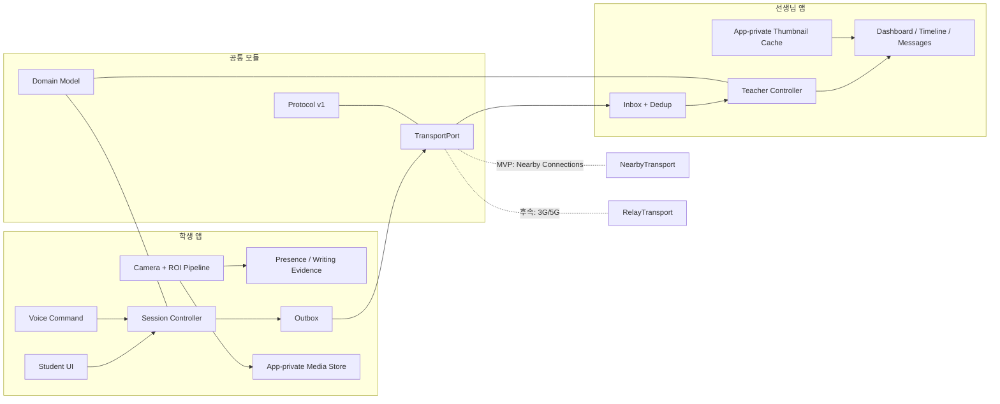

# 책상 공유 학습 앱 — MVP 시스템 설계 및 모듈 I/O 계약 v0.1

- 작성일: 2026-08-14
- 상태: 구현된 debug 프로토타입 기준 설계 + 후속 확장안
- 사용 범위: 비배포·개인용 Android 프로토타입
- 확정 대상: Android 학생폰 + Android 선생님폰, 1:1, 100m 이내 근거리 연결
- 제품 정의: **집중도를 점수화하는 감시 앱이 아니라, 자리·필기 움직임의 관찰 결과와 문제 풀이 작업물을 비동기로 공유하는 앱**

## 1. 먼저 확정하는 설계 결정

1. 기존 `FocusMonitor` 코드는 복사하지 않는다. 저장소에 라이선스 파일이 없고, 현재 구조는 참고용 프로토타입에 가깝다. 실패 원인과 일부 아이디어만 참고한다.
2. Android 네이티브 Kotlin + framework Views로 학생 앱과 선생님 앱을 분리한다. 이 프로토타입에서는 iOS와 앱스토어 배포를 범위에 넣지 않는다.
3. 학생폰이 세션·타이머의 단일 권위자(authority)다. 통신이 끊겨도 타이머와 촬영 주기는 학생폰에서 계속된다.
4. 사진은 한 장에 가변 화질을 섞지 않는다. 한 촬영 ID 아래에 다음 두 자산을 저장한다.
   - `BOOK_ROI`: 책 사각형만 고화질
   - `CONTEXT_THUMBNAIL`: 전체 구도는 작게 축소하고 책 바깥은 강하게 픽셀화한 썸네일
5. 자동 전송은 썸네일과 이벤트뿐이다. 선생님이 썸네일을 눌렀을 때만 학생폰의 고화질 책 영역을 요청한다.
6. `30초 진도 없음`을 의미상 판단하지 않는다. 앱이 관찰할 수 있는 것은 `책 영역의 필기/화면 변화가 30초 동안 없음(추정)`이다. 읽기·생각하기·암산은 구별할 수 없다.
7. 설치 구도에는 책 이외에 손·상체 또는 별도의 자리 판정 구역이 함께 보이도록 한다. 이 촬영 조건은 확정되었으며, 교정 중 해당 구역이 가려지면 `판정 불가`로 표시한다.
8. 선생님 명령은 몰래 촬영을 켜는 명령이 아니라 `시작 요청`이다. 학생폰에 소리와 5초 카운트다운을 표시하고 학생이 취소할 수 있게 한다.
9. 두 폰은 100m 이내에 있고 1:1로 연결한다. 근거리 전송은 Google Nearby Connections를 우선 구현하되 교체 가능한 `TransportPort` 뒤에 두고, 외부 3G/5G 버전은 같은 프로토콜을 쓰는 Relay WebSocket/HTTPS 구현으로 확장한다.

## 2. 범위

본 문서의 MVP는 개인 기기에서 직접 설치해 시험하는 비배포 프로토타입이다. 스토어 출시, 다중 사용자 운영, 조직용 관리 기능은 다루지 않는다.

### MVP 포함

- 학생 1명–선생님 1명 연결
- Nearby 자동 발견과 양쪽 인증 숫자 확인을 통한 연결 승인·해제
- 책 ROI 및 자리 판정 구역 교정
- 학생 음성/터치 시작, 선생님 시작 요청
- 기본 계획: 명상 5분 → 공부 40분 → 휴식 15분
- 공부 단계에서 10초 간격 촬영
- 자동 썸네일 전송, 요청 시 고화질 책 ROI 전송
- `풀었어` 음성/터치 이벤트와 5초 취소
- 자리 비움 10초, 책 영역 움직임 없음 30초 알림
- 비실시간 음성 메시지, 텍스트 답변 TTS, 음성 답변 재생
- 앱 실행 중 재전송 큐, 재연결, 제어 메시지 중복 제거
- 카메라·연결·세션 상태 표시

### MVP 제외

- 실시간 영상/음성 통화
- 집중도 점수, 감정·부정행위·성적 판단
- 얼굴 식별, OCR, 문제 자동 채점
- 외부 3G/5G 중계 서버와 클라우드 미디어 저장
- 여러 학생 동시 모니터링
- QR 초대, 프로세스 종료 뒤에도 유지되는 Room outbox
- 보관기간 설정·즉시 삭제·고화질 열람 기록
- 배터리·온도·저장공간 진단 화면
- 장기 랭킹·벌점·보상 시스템
- 사진 다운로드·외부 공유
- 명령 음성의 서버 전송 또는 모델 학습 재사용

## 3. `FocusMonitor` 비판적 검토

참고 저장소: [jinhoofkepco/FocusMonitor](https://github.com/jinhoofkepco/FocusMonitor), 감사 기준 [`ef2c051`](https://github.com/jinhoofkepco/FocusMonitor/commit/ef2c0514f14f396c93cf354037fa199561e157ab)

감사 시점에 이 저장소는 단일 commit, release/tag/CI 없음, 0 stars·0 forks이며 명시적 LICENSE도 없다. 따라서 공개되어 있다는 사실만으로 “커뮤니티에서 성공하고 보증된 코드” 또는 복제 가능한 코드로 간주하지 않는다. README와 실제 코드도 일부 불일치한다. 예를 들어 README는 프리뷰와 기기 밖 미전송을 설명하지만, 실제 camera bind는 `ImageAnalysis` 중심이고 앱 시작 시 Firebase transport가 함께 초기화된다.

| 관찰 | 근거 | 이번 설계의 대응 |
|---|---|---|
| 학생 UI와 오케스트레이션이 한 Activity에 집중됨 | [`MainActivity.java`](https://github.com/jinhoofkepco/FocusMonitor/blob/main/app/src/main/java/com/example/focusstudy/MainActivity.java#L67)는 약 1,649줄 | 화면, 상태, 카메라, 메시지, 알림을 feature/port로 분리 |
| 선생님 화면도 단일 Activity에 집중됨 | [`ViewerActivity.java`](https://github.com/jinhoofkepco/FocusMonitor/blob/main/viewer/src/main/java/com/example/focusviewer/ViewerActivity.java#L69)는 약 2,839줄 | 대시보드·갤러리·메시지·설정을 독립 feature로 분리 |
| 로컬 확인이 인증 없는 평문 HTTP·직접 IP 방식 | [`StudyRemoteServer.java`](https://github.com/jinhoofkepco/FocusMonitor/blob/main/app/src/main/java/com/example/focusstudy/StudyRemoteServer.java#L23)는 8088부터 포트를 열고, [`http://` 주소](https://github.com/jinhoofkepco/FocusMonitor/blob/main/app/src/main/java/com/example/focusstudy/StudyRemoteServer.java#L61)를 노출하며, [`0.0.0.0`](https://github.com/jinhoofkepco/FocusMonitor/blob/main/app/src/main/java/com/example/focusstudy/StudyRemoteServer.java#L117)에 바인딩 | 인증·암호화·연결 승인 기능이 있는 근거리 전송 계층으로 교체 |
| 브라우저 상태 갱신이 3초 폴링이고 브라우저 알림에 의존 | [`setInterval(tick,3000)`](https://github.com/jinhoofkepco/FocusMonitor/blob/main/app/src/main/java/com/example/focusstudy/StudyRemoteServer.java#L561); README도 OS 알림의 한계를 명시 | 지속 연결 + 이벤트 push + Android 로컬 알림 |
| 폴링마다 최대 180개 snapshot DOM을 다시 만들고 이미지에 `no-store`를 적용 | [`StudySessionState`](https://github.com/jinhoofkepco/FocusMonitor/blob/ef2c0514f14f396c93cf354037fa199561e157ab/app/src/main/java/com/example/focusstudy/StudySessionState.java#L14-L106), [`dashboardHtml`](https://github.com/jinhoofkepco/FocusMonitor/blob/ef2c0514f14f396c93cf354037fa199561e157ab/app/src/main/java/com/example/focusstudy/StudyRemoteServer.java#L505-L561) | 최신 상태 이벤트와 cursor 기반 timeline을 분리; 이미지 cache key 사용 |
| 10초 사진은 전체 프레임을 폭 390px, JPEG 품질 35로 축소 | [`FaceStudyFrameAnalyzer.java`](https://github.com/jinhoofkepco/FocusMonitor/blob/main/app/src/main/java/com/example/focusstudy/FaceStudyFrameAnalyzer.java#L79) | 고화질 ROI와 익명화된 썸네일을 별도 자산으로 생성 |
| 사진·음성을 Base64로 Firestore 문서에 포함 | [`CloudStudyPublisher.java`](https://github.com/jinhoofkepco/FocusMonitor/blob/main/app/src/main/java/com/example/focusstudy/CloudStudyPublisher.java#L295), [음성 Base64](https://github.com/jinhoofkepco/FocusMonitor/blob/main/app/src/main/java/com/example/focusstudy/CloudStudyPublisher.java#L408) | 메타데이터 이벤트와 바이너리 파일 전송을 분리; Base64 금지 |
| 필기·집중 판정이 고정 임계값과 색상/자세 휴리스틱에 강하게 의존 | [`StudyScorer.java`](https://github.com/jinhoofkepco/FocusMonitor/blob/main/app/src/main/java/com/example/focusstudy/StudyScorer.java#L6) | `집중도` 제거, 자리/책 움직임만 confidence와 UNKNOWN을 포함해 출력; 데이터셋 평가 필수 |
| 테스트가 실사진 ground truth가 아니라 수동 signal 값의 threshold 확인 중심 | [`StudyScorerTest`](https://github.com/jinhoofkepco/FocusMonitor/blob/ef2c0514f14f396c93cf354037fa199561e157ab/app/src/test/java/com/example/focusstudy/StudyScorerTest.java#L13-L138) | 지원 구도별 실제 영상 dataset, precision/recall, false-alert/hour로 검증 |
| 개발용 Firestore 규칙은 모든 인증 사용자에게 광범위한 읽기/쓰기를 허용 | [`FIREBASE_SETUP.md`](https://github.com/jinhoofkepco/FocusMonitor/blob/main/FIREBASE_SETUP.md#L54) | 세션별 키·역할·멤버십 검증; LAN도 신뢰망으로 취급하지 않음 |
| 저장소 루트에 명시적 LICENSE가 없음 | [저장소 루트](https://github.com/jinhoofkepco/FocusMonitor) | 코드를 재사용하지 않고 독립 구현 |

살릴 만한 방향은 CameraX의 오프라인 분석, 타이머 컨트롤러 분리 시도, transport 추상화 시도, 10초 스냅샷이라는 제품 실험이다. 다만 학생·선생님 쪽에 서로 다른 `StudyTransport`가 복제되어 있어 공통 프로토콜 계약으로 다시 정의해야 한다.

## 4. 목표 아키텍처



의존성 방향은 `app → feature → domain/port`이고, 인프라 모듈이 port를 구현한다. feature끼리 직접 참조하지 않는다. Android `Context`, CameraX, Nearby, Room 같은 프레임워크 타입은 domain 계약 밖으로 노출하지 않는다.

## 5. 권장 Gradle 모듈

```text
:app-student
:app-teacher
:core-domain
:core-protocol
:core-session
:core-storage-api
:transport-api
:transport-nearby
:transport-relay          # 인터페이스/테스트 더블만, 서버 구현은 후속
:media-capture-android
:activity-detection
:voice-command-api
:voice-command-android
:messaging
:student-ui
:teacher-ui
:test-fixtures
```

모듈 수를 더 잘게 쪼개는 것은 실제 변경 빈도와 빌드 시간을 본 뒤 결정한다. 위 경계보다 Activity별·클래스별 모듈을 추가하는 것은 MVP에서 과도하다.

## 6. 모듈 I/O 계약

Android 프레임워크 객체나 큰 `Bitmap`을 모듈 사이에 넘기지 않는다. 프레임은 제한 수명의 read-only 버퍼로, 저장 자산은 URI/파일 핸들과 메타데이터로 전달한다.

| 모듈 | 입력 | 출력 | 실패/불변조건 |
|---|---|---|---|
| `core-session` | `SessionCommand`, `StudyPlan`, monotonic `ClockTick` | `SessionState`, `PhaseChanged`, `AlarmCue` | 같은 `commandId`는 한 번만 적용; 네트워크 없이 진행 |
| `calibration` | 프리뷰 geometry, 사용자가 고른 book quad·presence zone, 샘플 프레임 | `CalibrationProfile`, `PlacementQuality` | 책 잘림·흐림·어두움·자리 구역 미노출을 구분 |
| `media-capture-android` | `CapturePolicy`, `CalibrationProfile`, `CaptureTick` | `AnalysisFrame`, `SnapshotBundle`, `CaptureHealth` | 원본 전체 프레임을 영구 저장하지 않음; 한 번에 분석 프레임 1개만 보유 |
| `activity-detection` | 저해상도 luma frame, book/presence geometry, phase | `ActivityEvidence` | `PRESENT/ABSENT/UNKNOWN`, `ACTIVE/INACTIVE/UNKNOWN`; 집중도 출력 금지 |
| `voice-command-android` | PCM16 16kHz mono, 활성 명령 집합 | `VoiceCommandCandidate`, `VoiceEngineHealth` | 명령 음성 저장·전송 금지; confidence·cooldown 필수 |
| `messaging` | 명시적 녹음/텍스트 작성, inbound message | `OutboxItem`, `MessageState`, `PlaybackRequest` | 음성 최대 60초; Base64 금지; 실패 시 재시도 |
| `core-storage-api` (후속) | snapshot/message/event 저장·조회·삭제 | URI/metadata, 보관 만료 이벤트 | 앱 전용 저장; 백업·갤러리 제외 |
| `transport-api` | `Envelope`, `MediaOffer`, `MediaRequest` | 연결 상태, inbound envelope, delivery receipt, transfer progress | at-least-once 전달; receiver는 idempotent; 연결 끊김과 행동 상태를 혼동 금지 |
| `transport-nearby` | session invite, protocol bytes/file | endpoint state, bytes/file payload | 인증 코드 확인 전 데이터 금지; 다른 payload 타입 순서에 의존 금지 |
| `transport-relay` | 동일한 protocol/event/media port | WSS/HTTPS 결과 | domain 변경 없이 교체 가능; MVP에서는 구현하지 않음 |
| `notifications` | domain alert/message/phase event | 학생 cue 또는 선생님 OS notification | 같은 사건 dedupe·cooldown; 잠금화면에 이름/사진/본문 비노출 |
| `telemetry-health` | 배터리, thermal, storage, camera/voice/transport heartbeat | `DeviceHealth` | 미디어·음성·전사문을 진단 로그에 넣지 않음 |

### 핵심 도메인 타입

```text
StudyPlan
  planId
  phases[]: { MEDITATION | STUDY | BREAK, durationMs }
  repeatPolicy

SessionCommand
  commandId
  kind: REQUEST_START | ACCEPT_START | CANCEL_START | PAUSE | RESUME | STOP
  origin: STUDENT_VOICE | STUDENT_TOUCH | TEACHER
  issuedAt

CalibrationProfile
  bookQuad: normalized 4-point polygon
  presenceZone: normalized polygon
  cameraId / rotation / version

SnapshotBundle
  snapshotId / capturedAt / calibrationVersion
  contextThumbnail: MediaRef
  bookRoi: MediaRef
  sha256 / dimensions / byteSize for each asset

ActivityEvidence
  presence: PRESENT | ABSENT | UNKNOWN
  presenceConfidence
  writing: ACTIVE | INACTIVE | UNKNOWN
  writingConfidence
  observedAt / reasonCodes[]
```

네트워크 wire 계약은 함께 제공하는 [`remote-study-protocol-v1.proto`](./remote-study-protocol-v1.proto)에 고정한다.

## 7. 세션 상태 머신

```text
UNPAIRED
  → PAIRED
  → CALIBRATING
  → READY
  → START_COUNTDOWN
  → MEDITATION
  → STUDY
  → BREAK
  → STUDY 또는 COMPLETE
```

`PAUSED`, `CONNECTION_LOST`, `CAMERA_UNAVAILABLE`, `PLACEMENT_INVALID`, `STORAGE_LOW`는 별도 상태/health로 관리한다.

규칙:

- 선생님 신호와 학생 음성 신호가 동시에 와도 `commandId`와 현재 상태로 세션을 하나만 만든다.
- 학생이 앱에서 `READY`를 만든 뒤에만 원격 시작 요청을 받는다. 앱이 종료·force-stop된 상태에서 선생님이 카메라/마이크를 몰래 깨우는 동작은 지원하지 않는다. Android는 background에서 camera/microphone foreground service 시작을 제한한다. [Android foreground service 제한](https://developer.android.com/develop/background-work/services/fgs/restrictions-bg-start)
- 학생폰의 monotonic clock을 기준으로 한다. wall clock은 화면 표시와 로그에만 쓴다.
- 연결이 끊겨도 타이머는 계속되고 앱 프로세스가 살아 있는 동안 이벤트는 메모리 outbox에서 재전송한다. Room 영속화는 후속 범위다.
- 명상·휴식·일시정지에서는 주기 촬영과 행동 판정을 중지한다.
- 교정이 깨지면 행동 판정 대신 `PLACEMENT_INVALID`를 전송한다.
- 재연결 후 이벤트는 sequence 순으로 적용하되, 이미 처리한 `messageId`는 ACK만 재전송한다.

## 8. 근거리 통신 설계

### 8.1 권장: Nearby Connections 어댑터

Google Nearby Connections는 기기 발견, 완전 암호화된 근거리 연결, 1:1/1:N topology, byte/file/stream payload와 진행률을 제공한다. MVP는 `P2P_POINT_TO_POINT`를 사용한다. 공식 문서: [개요](https://developers.google.com/nearby/connections/overview), [전송 타입](https://developers.google.com/nearby/connections/android/exchange-data), [연결 인증](https://developers.google.com/nearby/connections/android/manage-connections).

장점:

- 직접 IP·포트·브라우저 폴링 제거
- 게스트 Wi-Fi의 client isolation을 우회할 가능성이 높음
- 사진 파일을 메모리에 전부 올리지 않고 전송 가능
- 자체 TLS 서버/인증서를 구현하는 보안 위험 감소

제약:

- Google Play services와 Bluetooth/Nearby Wi-Fi 권한이 필요함
- Google Play services의 SDK telemetry 동작과 비활성화 가능 여부를 시험 기기에서 확인해야 함
- 약 100m 안팎의 `근거리` 연결 성격이며, 이번에 확정한 두 기기 간 거리 조건에 맞음
- byte와 file payload 사이의 도착 순서는 보장되지 않으므로 `mediaId` 상관관계가 필수
- 시험 기기에서 Play services를 사용할 수 없거나 연결 안정성 기준을 못 맞추면 `NSD + 인증된 WSS/HTTPS` 어댑터로 교체

현재 프로토타입은 자동 발견 후 Nearby가 제공하는 양쪽 인증 숫자를 학생·선생님이 확인해 연결을 승인한다. 향후 여러 선생님이 동시에 검색되는 환경에서는 `inviteId`, endpoint 식별자, 만료 시각, 일회용 nonce만 담은 QR 초대를 추가할 수 있다.

Nearby를 기본 구현으로 선택하고, 삼성·Pixel·중저가 기기와 실제 사용할 같은 Wi-Fi 환경에서 60분 연결, 선생님 앱 background, reconnect P95, 파일 전송률을 먼저 시험한다. 100m 이내 조건에서도 이 기준을 충족하지 못하는 기기 조합에 한해서만 NSD/WSS 어댑터를 비교한다.

### 8.2 앱 프로토콜의 신뢰성

- 전달 보장은 `at least once`다. 네트워크에서 정확히 한 번(exactly once)은 약속하지 않는다.
- 모든 명령·이벤트는 UUID `messageId`를 가진다.
- 학생과 선생님은 각각 단조 증가 `sequence`를 유지한다.
- 수신 측은 처리한 `messageId`를 보관하고 같은 메시지에는 부작용 없이 같은 ACK를 돌려준다.
- ACK 전 제어 이벤트는 현재 메모리 outbox에 남긴다. 프로세스 종료 복구가 필요해질 때 Room으로 포트를 구현한다.
- 재연결은 0.5s → 1s → 2s → 5s → 10s backoff와 jitter를 쓴다.
- heartbeat 5초, 15초 이상 없으면 `CONNECTION_STALE`; 이를 자리 비움으로 바꾸지 않는다.
- 썸네일·고화질·음성은 file payload, 상태·명령·ACK는 작은 protobuf payload로 보낸다.
- 파일 메타데이터와 실제 파일은 어느 쪽이 먼저 도착해도 `mediaId`로 결합한다.
- SHA-256, 크기, MIME, variant를 검증한 뒤에만 저장 완료 처리한다.

### 8.3 외부망 확장

후속 `RelayTransport`에서 두 휴대폰은 모두 서버로 outbound WSS 연결을 만든다. 이벤트 계약은 동일하고, 미디어는 짧은 수명의 서명 URL 또는 chunked HTTPS로 전달한다. FCM은 wake-up hint만 담당하고 데이터의 단일 원본이 되지 않는다. 이 단계는 서버 인증, 비용, 침해대응, 클라우드 보관을 별도 설계해야 한다.

## 9. 카메라·저부하 파이프라인

CameraX는 `Preview`, `ImageAnalysis`, `ImageCapture`를 한 번에 bind한다. 공식적으로 동시 use case를 지원하지만 기기별 조합에서 해상도가 낮아질 수 있으므로 실제 단말 검증이 필요하다. [CameraX architecture](https://developer.android.com/media/camera/camerax/architecture), [configuration](https://developer.android.com/media/camera/camerax/configuration).

### 분석 경로

- YUV 640×480 기본, `STRATEGY_KEEP_ONLY_LATEST`
- 1초에 최대 1프레임만 실제 분석하고 나머지는 즉시 `close`
- 가능한 한 Y plane/luma에서 차이·선명도·조명 계산
- pose/hand 같은 상대적으로 무거운 모델은 4~5초 주기 또는 불확실할 때만 실행
- RGB `Bitmap` 변환은 필요한 단계에서만 1개를 일시 생성

CameraX의 non-blocking backpressure는 분석이 느릴 때 최신 프레임만 유지한다. [Image analysis](https://developer.android.com/media/camera/camerax/analyze).

### 10초 촬영 경로

1. `STUDY` 상태에서만 10초 tick 생성
2. `ImageCapture`로 기기가 안정적으로 지원하는 고화질 JPEG 1장 획득
3. RAM/임시 파일에서 book quad를 perspective-correct crop
4. `BOOK_ROI`: 긴 변 최대 2,400px, JPEG Q92
5. `CONTEXT_THUMBNAIL`: 긴 변 최대 480px, JPEG Q55, 책 바깥 강한 픽셀화
6. 두 결과를 앱 전용 저장소로 이동
7. 전체 원본 임시 파일·버퍼 즉시 삭제
8. 썸네일만 자동 전송

`센서 최대 해상도`를 무조건 사용하는 것은 저부하 요구와 충돌한다. 품질 기준은 `기준 조명에서 일반 필기와 10~12pt 인쇄문을 선생님폰에서 판독 가능`으로 정의한다. 현재 2,400px 설정은 실제 사용할 기기에서 판독성·처리 시간·발열을 함께 측정해 조정해야 한다.

40분 공부에서 사진은 240개다. 목표 예산은 썸네일 자동 전송 10MB 이하, 고화질 ROI 로컬 저장 80MB 이하다.

## 10. 자리·필기 움직임 판정

### 교정 전제

- `bookQuad`: 글자와 필기 변화 판정 구역
- `presenceZone`: 손·상체·자리 중 하나가 지속적으로 보이는 구역
- 두 구역은 교정 완료의 필수 조건이며, presence zone이 화면 밖이거나 가려지면 준비 상태로 진입하지 않는다.

### 자리 상태

- 저해상도 context의 사람/손 evidence와 presence zone motion을 결합
- 2초 샘플 5회 연속 높은 `ABSENT` evidence일 때 10초 알림
- 다시 3회 연속 `PRESENT`면 복귀
- 카메라 가림·교정 이탈·연결 끊김이면 `UNKNOWN`, 자리 알림 억제

### 필기 움직임 상태

- perspective 보정된 저해상도 book ROI에서 밝기 보정 후 edge/difference를 계산
- 손으로 가려진 프레임, 페이지 넘김 직후, 단계 전환·메시지 재생 직후는 grace period
- 30초 동안 유의한 필기/페이지 변화가 없으면 `BOOK_MOTION_INACTIVE` 이벤트
- 움직임이 5초 이상 다시 나타나야 같은 알림을 재무장
- 같은 종류 알림은 기본 2분 cooldown

알림 문구는 `공부하지 않음`이 아니라 다음처럼 관찰 사실을 표시한다.

- `10초 동안 자리 판정 구역에서 학생이 보이지 않음(추정)`
- `30초 동안 책 영역의 움직임이 감지되지 않음`
- `연결이 끊겨 현재 상태를 확인할 수 없음`

## 11. 음성 명령과 음성 메시지

Android `SpeechRecognizer` 문서는 지속 인식용이 아니며 배터리·대역폭을 크게 사용할 수 있다고 명시한다. 따라서 `startListening()`을 40분 동안 반복하는 구현은 금지한다. [SpeechRecognizer](https://developer.android.com/reference/android/speech/SpeechRecognizer).

명령 엔진은 교체 가능한 port로 둔다.

```text
VoiceCommandEngine.start(activeCommands, AudioSource)
VoiceCommandEngine.events -> VoiceCommandCandidate(command, confidence, observedAt)
VoiceCommandEngine.health -> READY | DEGRADED | UNAVAILABLE
VoiceCommandEngine.stop()
```

현재 debug 프로토타입은 Android 시스템 `SpeechRecognizer`를 사용하며, 인식 서비스가 없는 기기에서는 터치 버튼만으로 모든 명령을 수행할 수 있다. 실제 40분 세션에서의 배터리·발열·네트워크 사용량이 기준을 넘으면 Porcupine 또는 sherpa-onnx 같은 on-device keyword engine을 별도 정확도/전력/라이선스 시험 뒤 교체한다.

명령 집합은 `공부 시작`, `풀었어`, `취소`, `잠깐 멈춰`, `공부 끝`이다. 한 번 인식 후 3초 cooldown, 즉시 소리/진동/화면 확인, `문제 완료`는 5초 취소를 제공한다. 명령용 PCM은 짧은 ring buffer 외에 저장·전송하지 않는다. 모든 명령에 48dp 이상의 터치 대체 버튼이 있어야 한다.

음성 메시지는 별도 push-to-record 흐름이다. 최대 60초 AAC mono로 저장하고, 보내기 전 재생·취소가 가능해야 한다. 텍스트 답변은 Android 기기 내 TTS로 읽는다.

## 12. UI 정보 구조

### 학생 앱

1. `연결`: 자동 발견, 양쪽 인증 숫자 확인, 승인/거절
2. `책 위치 맞추기`: 노란 책 ROI + 파란 자리 판정 구역, `배치 완료`
3. `대기/공부`: 큰 단계·남은 시간, 연결 상태, `공부 시작`과 `문제 풀었어`
4. `메시지`: 최대 60초 녹음·취소, 받은 텍스트 TTS/음성 답변 재생
5. `기록·설정`: 저빈도 기능을 접이식 영역에 배치

공부 화면의 자주 쓰는 항목은 `문제 완료`, `메시지`, `잠깐 멈춤` 세 개뿐이며 접히는 하단 tray에 둔다. gear 안에는 저빈도 설정만 둔다.

### 선생님 앱

1. `학생 상태`: 연결, 현재 단계/남은 시간, 완료 문제 수, 큰 `공부 시작 요청`
2. `사진`: 최신 사진과 최근 썸네일 12개, 자리/책 움직임 이벤트
3. `고화질 열람`: 썸네일 tap 후 해당 책 ROI만 요청하는 dialog
4. `메시지·기록`: 텍스트·음성 답장과 저빈도 항목을 접이식 영역에 배치

실시간 CCTV형 화면은 만들지 않는다. 잠금화면 알림에는 학생 이름·사진·메시지 본문을 넣지 않고 `학습 상태 알림 1건`만 표시한다.

## 13. 알림 정책

| 수준 | 사건 | 기본 동작 |
|---|---|---|
| 높음 | 자리 비움 추정 10초, 카메라/촬영/연결 장애 20초 | 소리+진동, 카드 상단 고정 |
| 보통 | 책 움직임 없음 30초, 학생 음성 메시지 | 일반 알림, 미확인 badge |
| 정보 | `풀었어`, 단계 전환, 재연결 | 짧은 진동 또는 묶음 알림 |

- 같은 사건은 새 알림을 반복하지 않고 지속 시간만 갱신한다.
- 연결 끊김 중 자리·움직임 알림은 억제한다.
- `풀었어`가 30초 안에 여러 번 오면 OS 알림은 묶되 이벤트는 모두 보존한다.
- 어떤 이벤트도 자동 벌점·성적·부정행위 판단으로 이어지지 않는다.

## 14. 로컬 데이터 관리 기본값

아래 항목은 배포·법률 체크리스트가 아니라, 개인용 프로토타입에서도 사진과 음성이 불필요하게 노출되거나 남지 않게 하는 실용적 품질 기준이다.

- 같은 Wi-Fi도 신뢰망으로 보지 않는다.
- Nearby 인증 숫자를 양쪽에서 확인한 뒤 연결하며, 파일은 앱 전용 저장소에 둔다.
- 학생폰은 시작할 때 사진 자산을 최대 600개(썸네일/ROI 약 300쌍), 발신 음성을 최대 20개로 정리하고 선생님폰도 발신 음성을 최대 20개로 정리한다.
- 전체 프레임과 명령 음성은 저장하지 않는다.
- `allowBackup=false`로 Android backup 대상에서 제외하고 갤러리에 내보내지 않는다. 별도의 애플리케이션 계층 파일 암호화는 아직 없다.
- 광고 SDK와 미디어를 읽는 분석 SDK를 넣지 않는다.
- 사진·음성을 AI 학습이나 제품 분석에 재사용하지 않는다.

### 현재 보관 동작과 후속안

| 데이터 | 기본 보관 | 위치 |
|---|---:|---|
| 전체 원본 프레임 | 저장 안 함, 처리 직후 삭제 | 학생폰 RAM/임시 파일 |
| 명령 인식 음성 | 저장·전송 안 함 | 학생폰 RAM |
| 고화질 책 ROI + 합성 썸네일 | 시작 시 최대 600개 파일로 정리 | 학생폰 앱 전용 저장소 |
| 발신 음성 메시지 | 시작 시 최대 20개 파일로 정리 | 각 발신자 앱 전용 저장소 |
| 수신 미디어·텍스트 상태 | 현재 실행 중 cache/메모리 중심 | 수신 앱 |

시간 기준 보관기간, 사용자가 누르는 전체 삭제, 열람 기록은 후속 기능이다.

## 15. 검증된 코드 사용 정책

`GitHub star 수`나 Reddit 사용 후기는 품질·보안을 보증하지 않는다. 다음 gate를 모두 통과한 코드만 사용한다.

1. 명시적 호환 라이선스(Apache-2.0/MIT/BSD 등)
2. 최근 유지보수·release·보안 공지 상태 확인
3. 공식 문서/샘플 또는 원 저장소 확인; 재배포된 snippet 금지
4. 의존 버전과 원본 URL/commit/license를 `THIRD_PARTY_NOTICES`와 SBOM에 기록
5. 핵심 기능은 adapter 뒤에 두어 교체 가능하게 유지
6. 공개 CVE·transitive dependency·권한 증가 검토
7. 우리 요구사항을 재현하는 contract/integration/soak test 추가

우선 후보:

- Camera: AndroidX CameraX
- UI/state: 현재 framework Views + Activity; 후속 규모 증가 시 ViewModel/Flow 검토
- DB: 현재 메모리 outbox; 프로세스 종료 복구 단계에서 Room 검토
- 근거리 전송: Google Play services Nearby Connections
- wire schema: 현재 32KiB 제한 수동 binary codec; 외부 relay 단계에서 Protocol Buffers Kotlin lite 검토
- 암호화가 추가로 필요한 저장/대체 transport: Google Tink + Android Keystore
- QR(후속 다중 기기 발견 보조): ZXing core 또는 ML Kit barcode scanning 중 라이선스·용량 비교 후 선택
- 음성 명령: Porcupine 또는 sherpa-onnx를 별도 정확도/전력/라이선스 spike 후 결정

`FocusMonitor`는 라이선스가 없으므로 소스 복사 대상에서 제외한다.

## 16. 구현 순서

1. 완료: `core-domain`, `core-protocol`, 메모리 outbox/ACK/dedup
2. 완료: 두 앱 shell, Nearby 발견·인증 숫자 승인, 지연 재연결
3. 완료: 학생 기준 타이머와 시작 요청/취소
4. 완료: CameraX ROI/thumbnail 분리, 원본 임시 파일 삭제
5. 완료: 자리·책 움직임 evidence와 alert edge 처리
6. 완료: 시스템 음성 명령과 모든 명령의 touch fallback
7. 완료: 비실시간 음성/텍스트 messaging
8. 남음: 실제 두 기기 70분 soak, 거리·불안정 연결·화면 전환·발열·배터리 시험
9. 후속: Room outbox, 시간 기준 삭제/열람 기록, 외부망 relay

## 17. 실기기 수용 기준

아래 수치는 자동화 테스트 통과를 뜻하지 않는다. 제공 APK를 실제 사용할 두 Android 기기에서 검증할 때의 합격 목표다.

### 연결·상태

- 승인되지 않은 근거리 기기는 학생 존재 여부도 조회할 수 없다.
- 동일 근거리 환경에서 시작/완료 이벤트 P95 2초 이내.
- 30초 네트워크 단절 후 앱 프로세스를 종료하지 않은 조건에서 재연결하며 pending 제어 메시지와 파일을 재시도한다.
- heartbeat 유실은 `연결 장애`로만 표시된다.

### 타이머

- 중복 시작 신호에도 세션은 하나다.
- 네트워크 단절 중에도 60분 누적 오차 1초 이내.
- 각 단계 알람은 정확히 한 번 발생한다.

### 사진

- 공부 중 `10초 ±1초` 간격.
- 썸네일 전달 P95 2초, 고화질 요청 P95 3초(정상 근거리 연결 기준).
- 기준 조명에서 일반 필기와 10~12pt 인쇄문 판독 가능.
- 전체 원본 프레임이 파일·DB·로그·backup에 남지 않음.
- 책 바깥에서 얼굴·방 세부가 식별되지 않음.

### 음성·메시지

- 정의된 한국어 시험환경에서 command recall 90% 이상.
- 4시간 시험에서 false activation 1회 미만 목표.
- 한 발화가 한 `PROBLEM_DONE`만 생성하고 5초 취소 가능.
- 오프라인 메시지는 재연결 후 순서대로 전달.

### 행동 evidence

- 실제 자리 비움 뒤 10~13초 안에 알림.
- 책 영역 무변화 뒤 30~33초 안에 알림.
- 연결/카메라/교정 장애 시 행동 알림 없음.
- 지원 구도 test set에서 precision/recall 각각 90% 미만이면 UI에 `실험적` 표시.

### 성능·로컬 데이터 관리

- 기준 중급 단말 40분 공부에서 배터리 감소 10%p 이하를 목표로 측정.
- 심각한 thermal throttling·ANR·camera stall 없음.
- app memory 300MB 이하.
- 썸네일 전송 40분당 10MB 이하, 고화질 로컬 저장 80MB 이하.
- 모든 touch target 48dp 이상, 색만으로 상태를 구분하지 않음.

## 18. 확정된 구현 전제

다음 조건은 구현 시작 기준으로 확정되었다.

1. **Android 전용 개인용 프로토타입**이며 iPhone·스토어 배포는 범위 밖이다.
2. **1학생–1선생님** 연결이다.
3. 휴대폰 구도에는 책 ROI 외에 손·상체 또는 자리 판정 구역이 들어온다.
4. 두 휴대폰은 **100m 이내**에 있고, 1차 구현은 같은 Wi-Fi 환경에서 검증한다.
5. 명상은 첫 회 한 번, 공부–휴식은 설정에 따라 반복한다.
6. 고화질은 `센서 최대`가 아니라 `글자 판독 기준을 만족하는 최고 안정 tier`다.
7. 현재 프로토타입은 시작 시 파일 개수 상한으로 로컬 캐시를 정리하며 시간 기준 보관기간 UI는 후속이다.
8. 학생폰이 오프라인이거나 로컬 파일이 삭제된 뒤에는 요청하지 않은 고화질을 선생님이 다시 열 수 없다.
